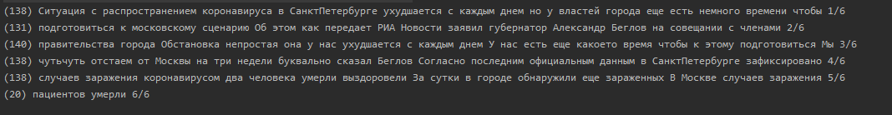
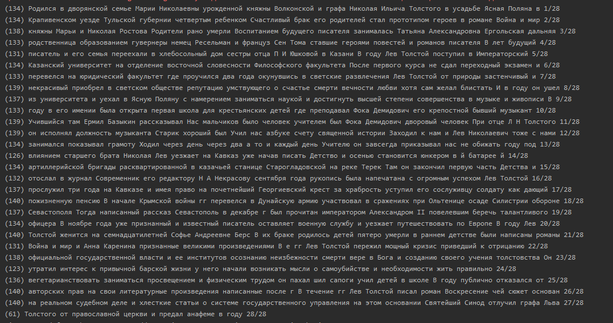

# Task #1. Splitter for legacy SMS service

## Задача

Нужно разбить текст на СМС длиной не более 140 символов.
(В тексте только слова и пробелы, других символов и знаков препинания нет)

Каждая отдельная СМС разбитого текста должна заканчиваться суффиксом «1/8» (где первое число - номер смс в тексте, второе число - общее кол-во смс в тексте)

Ограничение размера в 140 символов должно включать в себя суффикс

## Решение

1. делим текст на слова по символу пробела
2. склеиваем слова в строки длинной не более 140 символов с учетом суффикса XX/NN

NN - кол-во итоговых SMS. 

Для того, чтобы упростить расчет NN (кол-во итоговых SMS) я ввел suffixOverhead, 
как % от длинны входного текста. 

Оверхед 8% позволяет поместить суффикс длинной до 6 символов (XX/NN + пробел).

Значит, мы получим корректный результат для текстов, разбитых на 99 SMS или 12 тыс. символов.

Этого должно быть достаточно, учитывая специфику использования SMS. 

В случае необходимости метод можно адаптировать для текстов большего объема, добавив динамическую функцию для расчета suffixOverhead от длинны текста.

## Результат

Формат

`(символов в строке) строка`

# Task 2. Перебор комбинаций

## Задача

        ` 1 | 2  | 3
            |abc |defg
          4 | 5  | 6
         hij|klmn|opq
          7 | 8  | 9
         rst|uvw |xyz
            | 0  |`

Каждой кнопке на клавиатуре, соотвествует набор букв. 

Нужно вывести все возможные комбинации букв пораждаемые нажатием клавиш. 

Пример oldPhonePad/keys-2-3-9.txt

## Решение

Допускаю, что на вход метода можно подавать только числа в диапазоне 0-9, на клавиатуре других чисел нет.
В противном случаем можно снабдить метод проверкой входного аргумента.

При вводе последовательности клавиш 1-0-8 получаем
    ` u
      v
      w `        

